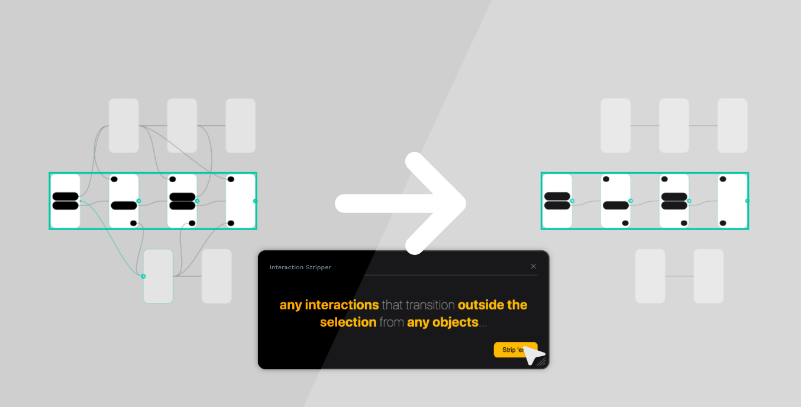
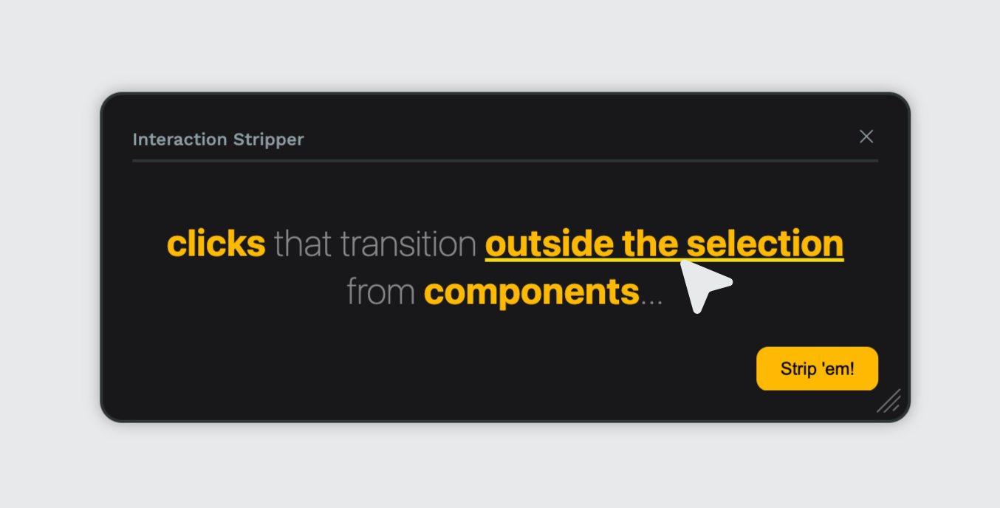
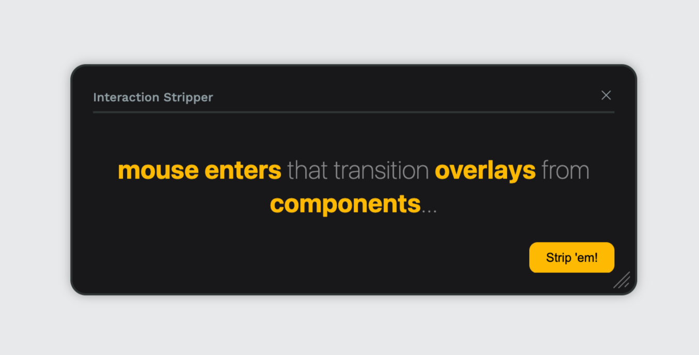
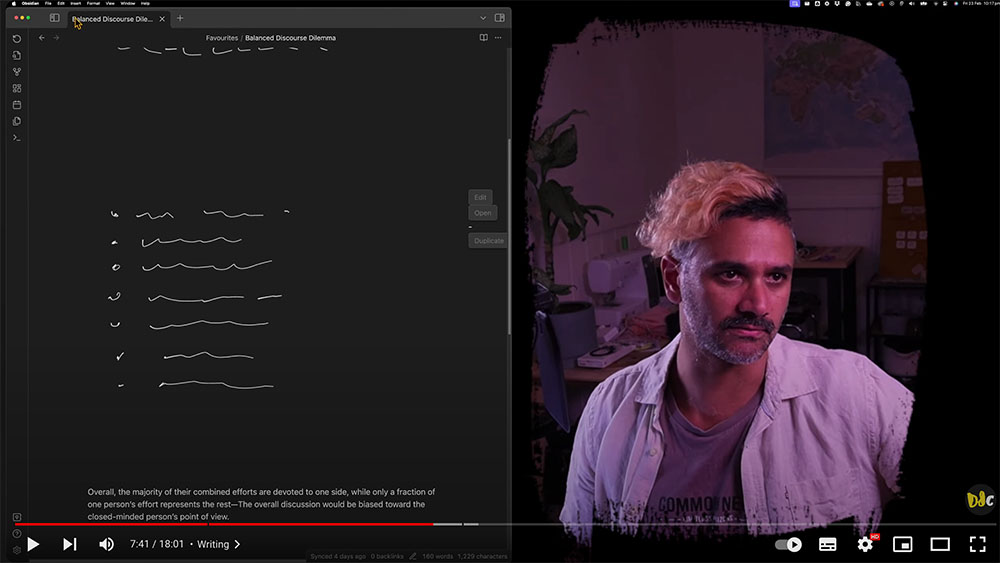

# Interaction Stripper

Interaction Stripper is a plugin for Penpot that enables bulk removal of interactions across selected boards.
Easily copy a flow and strip its superfluous interactions for a clearer journey demonstration.



Affected interactions are filterable; Limit to those of **particular journeys**, those that interact with **overlays**, or those using a **certain trigger**, and **more**.

<div style="display: flex; flex-direction: row; gap: 10px; margin-bottom: 3em;">
  
  
</div>

---

# For more information and demos, [designdebt.club](https://designdebt.club/projects/penpot-interaction-stripper/)...


## 📓 Development Diaries
I record regular development diaries. [Subscribe and follow along](https://www.youtube.com/@designdebtclub) to see features in development.

<p align="center">
    <a href="https://youtube.com/playlist?list=PLAiv7XV4xFx2NMRSCxdGiVombKO-TiMAL&si=TarnAk9A4kzzy0Gu" target="_blank">
        <br/>
        Click to view development diaries
    </a>
</p>

## ⚠️ Be careful
>As with many other plugins, this is a free gift to the community, provided 'as is' to help you out. While I'm doing my best to make it awesome (And I love feedback), there are always chances things might not work quite right. If you're worried, **copy or backup your boards** before running.

## 🪳 Report a bug
Found something that's not quite working right or do you have a feature request? Don't be shy, feel free to make some noise over on the [GitHub Issues](https://github.com/daledesilva/penpot_interaction-stripper/issues) page. But be sure to check if someone has already posted the same issue and comment on theirs if they have.

## ❤️ Support
If you find this plugin saves you time or helps you in some way, please consider supporting my development of plugins and other free community material like this.

<p>
  <a href="https://twitter.com/daledesilva" target="_blank_">
    
  </a>
  <a href="https://indieweb.social/@daledesilva" target="_blank">
    
  </a>
  <a href="https://www.threads.net/@daledesilva" target="_blank">
    
  </a>
  <a href="https://bsky.app/profile/daledesilva.bsky.social" target="_blank">
    
  </a>
  <a href="https://ko-fi.com/N4N3JLUCW" target="_blank">
    
  </a>
</p>

## 🤖 My other work
You can find links to my other projects on [designdebt.club](https://designdebt.club), where I blog about design and development, as well as release other plugins like this one. You can also find my writing at at [falterinresolute.com](https://falterinresolute.com) where I combine philosophy and animation.

<p>
  <a href="https://designdebt.club" target="_blank">
    
  </a>
  <a href="https://falterinresolute.com" target="_blank">
    
  </a>
</p>

## 🏛️ License
>The plugin is open source, so feel free to snoop on the code or fork it for your own needs. It’s licensed under [AGPL 3.0](https://www.gnu.org/licenses/agpl-3.0.en.html), which essentially means that any modifications you make to it for public or commercial use must also be open-source under the same license.

## Forking and creating a variation
After forking, cloning, and installing the dependencies. The below commands are what you'll need to get going.
If you're new to coding or working with Penpot, you can find far more detailed instructions in [the original template repository](https://penpot.github.io/penpot-plugin-starter-template/).

### Useful terminal commands
Run development server:
```bash
npm run dev
```
The URL to load into Penpot during development:
```
http://localhost:4400/manifest.json
```
Build the plugin:
```bash
npm run build
```
